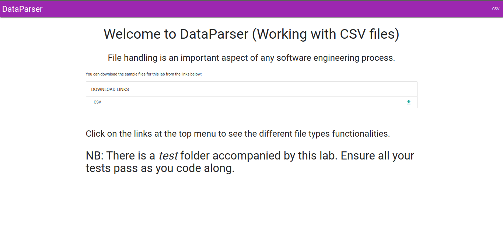
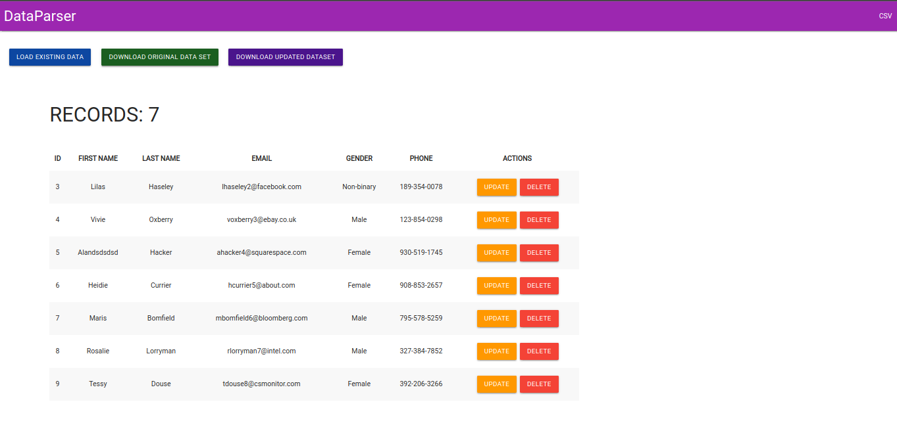

# DATA PARSER
   

# Description
Data Parser is a Java application built with Spring Boot 2.6.+ and Spring Framework 5.+.

The application is used as a demonstration for working with CSV file in Java.

# Live Link

[DATA PARSER IN ACTION](https://mysterious-tor-52573.herokuapp.com/)

# Getting Started
In order for you to use the content on this repo ensure you have the following:

- A computer that runs on either of the following; (Windows 7+, Linux, Mac OS)
- Java JDK 1.8+ [Download](https://www.oracle.com/java/technologies/javase/javase8u211-later-archive-downloads.html)
- Some bit of patience for your own sanity.

## Dependencies
This application was built with the following dependencies:

- [Spring Boot](https://spring.io/) - Server-side web framework
- [Thymeleaf](https://www.thymeleaf.org/) - Templating engine for Spring
- [Gson](https://github.com/google/gson) - JSON Serializer library
- [JUnit](https://junit.org/junit5/) - Unit testing
- [Mockito](https://site.mockito.org/) - Mocking for easy Unit testing
- [Hamcrest](http://hamcrest.org/) - Complementary Unit testing library

## Installation

To use this repo on your machine requires some simple steps

### Alternative One

- Open a terminal / command line interface on your computer
- Clone the repo by using the following:

        git clone https://github.com/otsembo/DataParser.git

- Be patient as it creates a copy on your local machine for you.
- Change directory to the repo folder:

        cd DataParser

- (Optional) Open it in ``Visual Studio Code``

        code .

- (Alternate Option) Open it in any editor of your choice.
- Hurray! You are one step closer to being as intelligent as Einstein.

### Alternative Two

- On the top right corner of this page there is a button labelled ``Fork``.
- Click on that button to fork the repo to your own account.
- Take on the process in ``Alternative One`` above.
- Remember to replace your username when cloning.

        git clone https://github.com/your-username-here/DataParser.git

# Running the application

Running the application is very straight forward. You can use the following steps to run the app.

- Install required dependencies from maven

      mvn install
- Run the application on the browser

      mvn spring-boot:run

- Open the application on your browser's localhost on port ``8080``
    
      https://127.0.0.1:8080

# Screenshots

Take a snippet at what the application looks like

| HOME SCREEN                                 | DATA SCREEN                                      |
|---------------------------------------------|--------------------------------------------------|
|  |  |

# Known Bugs
The updating and deleting functionalities work on the local server only for now. 

This is due to the limitation that jar files offer, in that they can only be in **READ** mode and **NOT write** .

# Authors
This project was contributed to by:
- [Ian Okumu](https://github.com/otsembo/)

# License
The project is licensed under Apache 2.0.